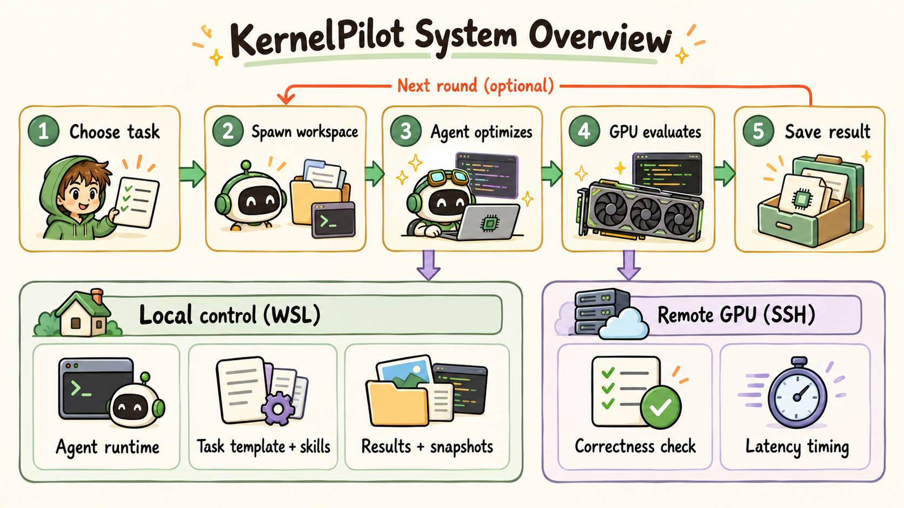

# KernelPilot

KernelPilot is a personal GPU kernel optimization project. It gives a coding agent an isolated task workspace, checks candidates with a fixed benchmark, and uses the results to guide the next attempt.

The current workflow targets [KernelBench](https://github.com/ScalingIntelligence/KernelBench) tasks. A local WSL control process runs the agent; a remote GPU host performs correctness and latency evaluation over SSH.

In one recorded RTX 4090 task, a Codex-generated Triton reverse scan reduced KernelBench `91_cumsum_reverse` latency from 30.7 ms to 9.84 ms (**3.12×**). [See the example](#recorded-ssh-example).

## System overview

KernelPilot supports a manual single-task workflow and an optional multi-round campaign. The diagram shows the campaign: a master agent selects a parent kernel, spawns an isolated child workspace, and drives a sub agent to optimize and evaluate candidates. Archived variants can seed later rounds.



The sub agent uses two layers. **(a) Generic Agent Substrate** supplies the agent loop, context management, and tool use. Codex and Claude Code have runtime adapters today; other agents can be added through the same adapter interface. **(b) Kernel-Specific Harness** supplies the task template, benchmark adapter, reference archive (variants and lessons across sessions), and skill catalog. Optional harness proposals are reviewed against scope, evidence, and regression checks before a guidance change is applied.

The [quick start](#quick-start) follows the manual path: you drive one child workspace directly and evaluate over SSH on a GPU host. See [closed-loop campaigns](docs/closed-loop.md) for the optional master/sub workflow.

## What is implemented

- **Agent runtimes:** Codex and Claude Code share a task contract and workspace setup through `agent_runtime/`.
- **Isolated search:** `campaign/` plans two distinct branches, evaluates each child, and promotes only a correctness-passing improvement.
- **Evaluation boundary:** `benchmark_backend/` runs a fixed remote evaluator and records the evaluated candidate snapshot and formal benchmark budget.
- **Experience memory:** `experience_memory/` stores compact, result-bound lessons for later tasks.
- **Optional harness evolution:** `harness_evolution/` can propose small guidance changes after a campaign and applies them only after scope, evidence, and regression gates.

## Repository map

| Path | Purpose |
| --- | --- |
| `spawn.py` | Create a task workspace from a KernelBench operator |
| `agent_runtime/`, `campaign/` | Agent execution and bounded branch search |
| `benchmark_backend/`, `scripts/benchmark_adapter.py` | Benchmark transport and KernelBench adapter |
| `experience_memory/`, `harness_evolution/` | Cross-task lessons and gated harness proposals |
| `templates/` | Files copied into a new task workspace |
| `tests/` | Local contract and regression tests |

## Quick start

Use WSL with Python 3.10 or newer, a native Codex CLI, OpenSSH, a KernelBench checkout, and an SSH-accessible GPU machine with KernelBench and PyTorch installed. GPU evaluation requires your own remote environment.

```bash
git clone https://github.com/pai3021/KernelPilot.git
cd KernelPilot
python3 -m pip install -e '.[kernelbench]'
git clone https://github.com/ScalingIntelligence/KernelBench.git ../KernelBench
git -C ../KernelBench checkout 423217d
cp configs/remote.example.toml configs/remote.local.toml
# Edit configs/remote.local.toml for your SSH host and remote paths.

python3 spawn.py --dataset ../KernelBench
python3 spawn.py \
  --operator 91_cumsum_reverse \
  --dataset ../KernelBench \
  --backend ssh --gpu rtx4090 --agent codex \
  --remote-config configs/remote.local.toml --name demo
```

The command prints the child workspace path. Enter it, read `CODEX_TASK.md`, and start `codex`. Use `bash scripts/bench.sh --label "first candidate"` to evaluate a candidate. Keep your local SSH configuration and remote paths out of Git. `KERNELPILOT_REMOTE_CONFIG` can supply the config path for scripted spawns.

The remote host must contain the repository's evaluator code and a compatible KernelBench checkout. See [setup details](docs/installation.md) before a GPU run. For a local, GPU-free check of the repository contracts:

```bash
python3 -m unittest discover -s tests -q
```

## Recorded SSH example

A Codex agent optimized KernelBench Level 1 `91_cumsum_reverse` with a [Triton reverse-scan kernel](examples/kernelbench_reverse_cumsum_triton.py). It combines the reference's flip, cumulative sum, and flip operations into one kernel. A recorded SSH evaluation on an NVIDIA GeForce RTX 4090 produced:

| Check | Recorded result |
| --- | --- |
| Correctness | PASSED (3 trials) |
| Reference latency | 30.7 ms |
| Candidate latency | 9.84 ms |
| Speedup on this task | 3.12× |
| Timing | 20 CUDA-event trials |
| Evaluated candidate | SHA-256 `8acc4ec88b8cb56d5516775db4b9c7cef1b516487b70b2b1da4114a2fd8ecde2` |

To reproduce the task, use the `91_cumsum_reverse` quick-start command above, copy the example to the generated child's `solution/kernel.py`, set `language = "triton"` under `[build]` in `config.toml`, then run `bash scripts/bench.sh --label "reverse-cumsum"`.

## Evaluation scope

KernelPilot records correctness, latency, candidate identity, and benchmark budget for each formal evaluation. See [evaluation notes](docs/evaluation.md) for the release evidence boundary.

## License and credits

Released under the [MIT license](LICENSE). See [third-party notices](THIRD_PARTY_NOTICES.md) for source attribution. KernelBench, Codex, Claude Code, and GPU tooling are separate projects with their own terms.
